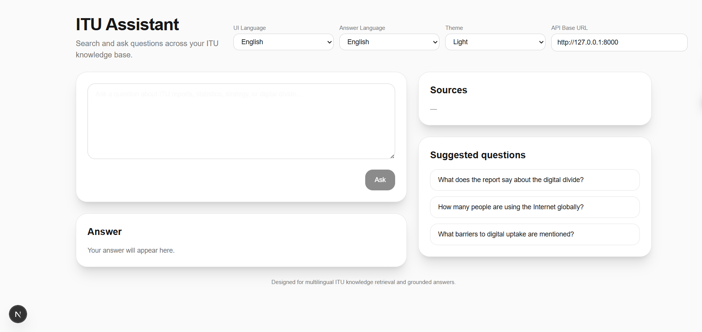

# ITU Assistant

A multilingual Retrieval-Augmented Generation (RAG) application for querying an ITU-focused knowledge base built from official reports, statistics, and strategic documents.

> **Default documentation language:** English  
> This README also includes **Chinese** and **Japanese** quick-start sections for multilingual teams.



---

## Table of Contents

1. [Overview](#overview)
2. [Features](#features)
3. [System Architecture](#system-architecture)
4. [Project Structure](#project-structure)
5. [Requirements](#requirements)
6. [Environment Variables](#environment-variables)
7. [Quick Start (English)](#quick-start-english)
8. [How the Data Pipeline Works](#how-the-data-pipeline-works)
9. [How to Add New Files to the Knowledge Base](#how-to-add-new-files-to-the-knowledge-base)
10. [How Retrieval and Answering Work](#how-retrieval-and-answering-work)
11. [API Reference](#api-reference)
12. [Frontend Notes](#frontend-notes)
13. [Troubleshooting](#troubleshooting)
14. [Chinese Quick Start 中文快速开始](#chinese-quick-start-中文快速开始)
15. [Japanese Quick Start 日本語クイックスタート](#japanese-quick-start-日本語クイックスタート)

---

## Overview

**ITU Assistant** is a local-first, multilingual RAG system designed to answer questions grounded in a curated ITU document collection.

The stack includes:

- **Document ingestion pipeline** for PDF parsing, cleaning, deduplication, metadata generation, and chunking
- **Vector indexing** using embeddings + FAISS
- **Retrieval layer** with reranking and noise reduction
- **Answer generation layer** that produces grounded answers with citations
- **FastAPI backend** for `/retrieve` and `/ask`
- **Next.js frontend** with:
  - UI language switching
  - Answer language switching
  - Theme mode switching (System / Light / Dark)

This repository is designed for iterative expansion: start with ITU, then extend to other UN agencies later if needed.

---

## Features

### Core RAG Features
- PDF ingestion and parsing
- Paragraph-aware chunking
- Metadata export to CSV / Excel / JSONL
- Embedding-based semantic retrieval
- FAISS vector index
- Citation-aware answer generation
- Queryable API endpoints

### Frontend Features
- Default English UI
- Multilingual UI options:
  - English
  - 中文
  - 日本語
- Answer language switching
- Theme switching:
  - System
  - Light
  - Dark
- Suggested questions
- Source display panel

### Data Quality Features
- Duplicate document detection
- Noise filtering for:
  - Foreword
  - Table of contents
  - Methodology pages
- Cleaner title inference
- Chunk-level deduplication

---

## System Architecture

```text
PDF files
  ↓
pipeline.py
  ↓
parsed JSON + chunks JSONL + CSV/XLSX exports
  ↓
build_index.py
  ↓
FAISS index + chunk metadata
  ↓
retrieve.py
  ↓
top-k relevant chunks
  ↓
ask.py
  ↓
grounded answer with citations
  ↓
FastAPI (main.py)
  ↓
Next.js frontend
```

### Conceptual Layers

1. **Ingestion Layer**  
   Converts raw PDFs into structured text chunks.

2. **Retrieval Layer**  
   Finds the most relevant chunks for a user query.

3. **Generation Layer**  
   Produces a natural-language answer strictly based on retrieved evidence.

4. **Presentation Layer**  
   Exposes the system through REST APIs and a multilingual frontend.

---

## Project Structure

```text
ITUassistant/
├─ app/
│  ├─ api/
│  │  └─ main.py
│  ├─ ingest/
│  │  ├─ pipeline.py
│  │  └─ build_index.py
│  └─ rag/
│     ├─ retrieve.py
│     └─ ask.py
├─ data/
│  ├─ itu_pdfs/         # raw PDF files
│  ├─ parsed/           # parsed document JSON files
│  ├─ chunks/           # per-document chunk JSONL files
│  ├─ exports/          # documents.csv / chunks.csv / xlsx exports
│  └─ index/            # FAISS index + metadata
├─ frontend/
│  ├─ .env.local
│  ├─ package.json
│  └─ src/app/
│     ├─ layout.tsx
│     ├─ page.tsx
│     └─ globals.css
└─ .env
```

---

## Requirements

### Backend
- Python 3.10+
- Conda or venv environment recommended

### Frontend
- Node.js 18+
- npm / pnpm / yarn

### Python Packages
Typical backend dependencies include:

```bash
pip install pymupdf pandas openpyxl numpy faiss-cpu fastapi uvicorn python-dotenv openai
```

### Frontend Packages
If you created the frontend with `create-next-app`, most dependencies are already installed.

---

## Environment Variables

Create a file at the project root:

```text
E:\MyProjects\ITUassistant\.env
```

Recommended contents:

```env
DASHSCOPE_API_KEY=your_dashscope_api_key_here
CHAT_MODEL=qwen-plus
```

Frontend environment file:

```text
E:\MyProjects\ITUassistant\frontend\.env.local
```

Recommended contents:

```env
NEXT_PUBLIC_API_BASE=http://127.0.0.1:8000
```

---

## Quick Start (English)

### 1) Prepare the backend environment

Activate your Python environment, for example:

```bash
conda activate ITUassistant
```

Install dependencies if needed:

```bash
pip install pymupdf pandas openpyxl numpy faiss-cpu fastapi uvicorn python-dotenv openai
```

---

### 2) Put source PDFs into the raw data folder

Place your ITU PDF files into:

```text
data/itu_pdfs/
```

Example filenames:

```text
facts_2022.pdf
facts_2023.pdf
facts_2024.pdf
itu_annual_report_2024.pdf
mdd_2024_lldc.pdf
```

> Use clear, stable filenames. The pipeline uses filenames to infer metadata and titles more reliably.

---

### 3) Run the ingestion pipeline

From the project root:

```bash
python app/ingest/pipeline.py
```

This will generate:

- `data/parsed/*.json`
- `data/chunks/*.jsonl`
- `data/exports/documents.csv`
- `data/exports/chunks.csv`
- `data/exports/documents.xlsx`
- `data/exports/chunks.xlsx`

---

### 4) Build the vector index

```bash
python app/ingest/build_index.py
```

This will generate:

- `data/index/itu_chunks.faiss`
- `data/index/chunk_metadata.json`
- `data/index/build_info.json`

---

### 5) Test retrieval

```bash
python app/rag/retrieve.py
```

Use it to verify whether the top results are relevant before testing answer generation.

---

### 6) Test answer generation

```bash
python app/rag/ask.py
```

This should produce:
- a grounded answer
- key points
- citations
- retrieved source summary

---

### 7) Start the API server

```bash
uvicorn app.api.main:app --reload
```

API docs will be available at:

```text
http://127.0.0.1:8000/docs
```

---

### 8) Start the frontend

```bash
cd frontend
npm install
npm run dev
```

Open:

```text
http://localhost:3000
```

---

## How the Data Pipeline Works

The pipeline is not “just file conversion.” It transforms PDFs into **AI-searchable knowledge**.

### Stages

#### 1. Parse
Reads PDF text page by page with PyMuPDF.

#### 2. Clean
Removes:
- control characters
- repetitive page artifacts
- dot leaders
- common PDF garbage characters

#### 3. Detect titles
Uses filename-first title inference, with page-based fallback.

#### 4. Split into paragraph units
Avoids crude fixed-length splitting whenever possible.

#### 5. Chunk
Builds medium-sized retrieval chunks optimized for semantic search.

#### 6. Export
Creates machine-friendly and human-friendly outputs:
- JSON
- JSONL
- CSV
- XLSX

---

## How to Add New Files to the Knowledge Base

This is the most important operational workflow.

### Standard Workflow

#### Step 1 — Add PDFs
Copy new PDF files into:

```text
data/itu_pdfs/
```

#### Step 2 — Re-run ingestion
```bash
python app/ingest/pipeline.py
```

#### Step 3 — Rebuild the index
```bash
python app/ingest/build_index.py
```

#### Step 4 — Re-test
- `python app/rag/retrieve.py`
- `python app/rag/ask.py`

#### Step 5 — Restart the API (if already running)
Stop and start:

```bash
uvicorn app.api.main:app --reload
```

---

### Good File Naming Practices

Use meaningful names such as:

```text
facts_2024.pdf
itu_annual_report_2024.pdf
mdd_2024_lldc.pdf
```

Avoid names like:

```text
document1.pdf
scan_final_v2.pdf
newfile.pdf
```

Because clean filenames improve:
- metadata consistency
- title inference
- debugging
- future maintenance

---

### When to Add More Files

Add more files when:

- the answer is missing because the knowledge base truly lacks the content
- you want to support new topics (e.g. spectrum, AI governance, cybersecurity)
- you want stronger coverage for:
  - mission / mandate questions
  - official strategy questions
  - legal or governance documents

Do **not** add more files just because one query is weak.  
Sometimes the real issue is:
- noisy chunks
- poor title extraction
- weak retrieval ranking

Always diagnose retrieval quality first.

---

## How Retrieval and Answering Work

### Retrieval
`retrieve.py`:
- embeds the user query
- searches FAISS
- reranks candidate chunks
- filters noise
- deduplicates similar results

### Answering
`ask.py`:
- calls `search()`
- formats retrieved chunks into context
- sends them to the chat model
- enforces grounded answering rules
- returns answer + citations

### Why This Matters
Without retrieval, the model may hallucinate.  
With retrieval, the model answers “open-book” using your ITU sources.

---

## API Reference

### `GET /health`

Health check.

Example response:

```json
{
  "status": "ok",
  "service": "ITU Assistant API"
}
```

---

### `POST /retrieve`

Retrieve relevant chunks only.

Example request:

```json
{
  "query": "What does the report say about the digital divide?",
  "top_k": 4,
  "fetch_k": 30
}
```

---

### `POST /ask`

Full RAG answer generation.

Example request:

```json
{
  "query": "What does the report say about the digital divide?",
  "top_k": 4,
  "fetch_k": 30
}
```

Example response shape:

```json
{
  "query": "What does the report say about the digital divide?",
  "answer": "Answer: ...",
  "citations": [
    {
      "source_id": 1,
      "title": "Measuring Digital Development: Facts and Figures 2022",
      "filename": "facts_2022.pdf",
      "page_start": 5,
      "page_end": 5,
      "score": 0.86
    }
  ],
  "results": ["..."]
}
```

---

## Frontend Notes

### Supported Frontend Features
- multilingual UI
- answer language switching
- theme switching
- API URL configuration
- answer panel
- source list
- suggested questions

### Important Note About Theme Hydration
If you use system theme detection in Next.js App Router, avoid hydration mismatches by waiting until client mount before reading:
- `window.matchMedia`
- `localStorage`

This is already handled in the current `page.tsx` implementation.

---

## Troubleshooting

### 1. `Missing DASHSCOPE_API_KEY`
Cause:
- `.env` not found
- wrong variable name
- server not restarted

Fix:
- make sure project root `.env` contains:

```env
DASHSCOPE_API_KEY=your_key
CHAT_MODEL=qwen-plus
```

- restart backend

---

### 2. `/ask` returns HTTP 500
Common causes:
- missing API key
- index file missing
- metadata file missing
- model API error

Check:
- backend console traceback
- `data/index/itu_chunks.faiss`
- `data/index/chunk_metadata.json`

---

### 3. Retrieval quality is weak
Check:
- duplicate PDFs
- noisy chunks
- foreword still ranking too high
- title extraction quality
- whether the source documents actually contain the answer

---

### 4. Frontend shows “Something went wrong”
This usually means:
- FastAPI is not running
- wrong `NEXT_PUBLIC_API_BASE`
- backend returned 500
- CORS or network issue

Check:
- `http://127.0.0.1:8000/health`
- browser devtools network tab
- backend logs

---

### 5. Hydration mismatch in Next.js
Typical cause:
- server/client theme mismatch

Fix:
- use a `mounted` state
- only resolve system theme after client mount

---

## Chinese Quick Start 中文快速开始

### 目标
这是一个基于 ITU 文档知识库的 RAG 系统，支持：

- PDF 入库
- 向量检索
- 带引用问答
- FastAPI 后端
- Next.js 多语言前端

### 快速开始步骤

#### 1. 把 PDF 放到
```text
data/itu_pdfs/
```

#### 2. 运行数据处理
```bash
python app/ingest/pipeline.py
```

#### 3. 构建索引
```bash
python app/ingest/build_index.py
```

#### 4. 测试检索
```bash
python app/rag/retrieve.py
```

#### 5. 测试问答
```bash
python app/rag/ask.py
```

#### 6. 启动后端
```bash
uvicorn app.api.main:app --reload
```

#### 7. 启动前端
```bash
cd frontend
npm install
npm run dev
```

### 新增文件怎么做
1. 把新的 PDF 复制到 `data/itu_pdfs/`
2. 重新运行：
   ```bash
   python app/ingest/pipeline.py
   python app/ingest/build_index.py
   ```
3. 重启 FastAPI
4. 重新测试 `/retrieve` 和 `/ask`

### 注意
不要因为一个问题效果不好就立刻狂加 PDF。  
先判断是：
- 知识库里真的没有内容
还是
- 检索排序还没调好

---

## Japanese Quick Start 日本語クイックスタート

### 概要
このプロジェクトは ITU 文書を対象にした RAG システムです。

機能:
- PDF 取り込み
- ベクトル検索
- 出典付き回答
- FastAPI バックエンド
- Next.js 多言語フロントエンド

### クイックスタート

#### 1. PDF を配置
```text
data/itu_pdfs/
```

#### 2. パイプライン実行
```bash
python app/ingest/pipeline.py
```

#### 3. インデックス構築
```bash
python app/ingest/build_index.py
```

#### 4. 検索テスト
```bash
python app/rag/retrieve.py
```

#### 5. 回答生成テスト
```bash
python app/rag/ask.py
```

#### 6. API 起動
```bash
uvicorn app.api.main:app --reload
```

#### 7. フロントエンド起動
```bash
cd frontend
npm install
npm run dev
```

### 新しいファイルの追加方法
1. 新しい PDF を `data/itu_pdfs/` に追加
2. 次を再実行:
   ```bash
   python app/ingest/pipeline.py
   python app/ingest/build_index.py
   ```
3. FastAPI を再起動
4. `/retrieve` と `/ask` を再確認

### 注意点
検索精度が弱いときは、すぐに文書を大量追加する前に：
- チャンク品質
- 重複文書
- ノイズ
- ランキング
を先に確認してください。

---

## Recommended Next Steps

After the first working version, recommended upgrades are:

1. Add a formal `answer_language` field to `/ask`
2. Add streaming answer support
3. Add source expansion in the frontend
4. Improve title normalization further
5. Add more ITU strategy / governance / mandate documents
6. Package the backend for deployment

---

## License / Internal Note

This project currently appears to be an internal or private application prototype.  
Add your own license policy before public distribution.
